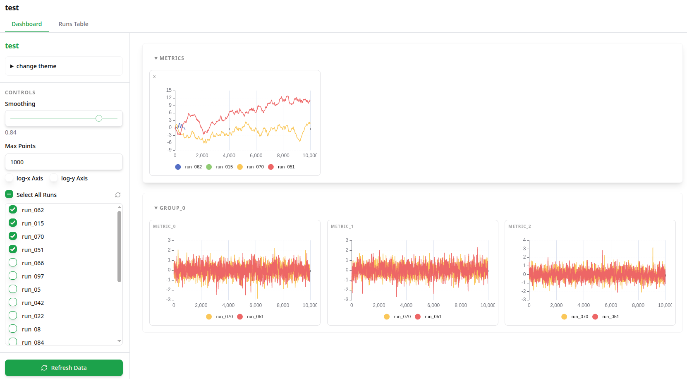
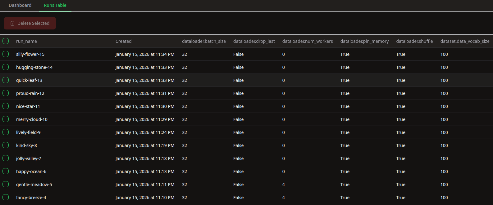
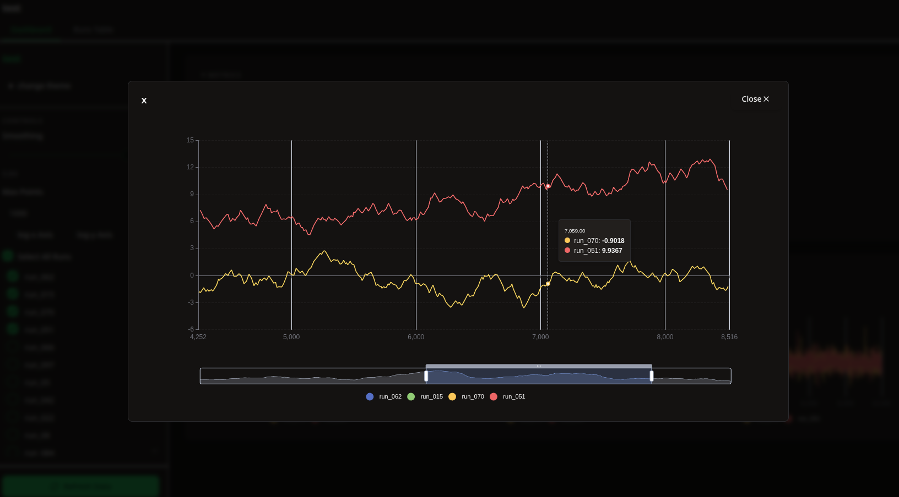

# trackio-ui
[](https://pypi.org/project/trackio-ui/)

[](https://opensource.org/licenses/MIT)
[](https://github.com/ssslakter/trackio_ui)

A simple UI for the trackio dashboard, written in **FastHTML**. The primary reason for creating this was the poor performance of the Gradio frontend for trackio.

Original Trackio repository: https://github.com/gradio-app/trackio

With this UI, you can configure the maximum number of data points for graphs to prevent slow communication and rendering.

## Installation
```sh
pip install trackio-ui
```

You can also install the latest version using git:

```sh
pip install "trackio-ui @ git+https://github.com/ssslakter/trackio_ui.git"
```

## Getting Started
To start the local trackio-ui server, run the following command:
```sh
trackio-ui --project "my-project" 
```

## Highlights
- Fast dashboard workflow for local experiments.
- Switch between dark and light themes.
- Preview charts for detailed inspection.
- Manage runs from the table, including deleting selected runs.
- Inspect run hyperparameters.

### Screenshots

#### Dashbord showing runs logged with trackio


#### Runs Table and Hyperparameters


#### Preview graph and vary the time-scale



## Configuration
By default, the app looks for Trackio projects in the `~/.cache/huggingface/trackio` folder, but you can change this location by setting the `TRACKIO_ROOT` environment variable. The project names you use in the URL must match your Trackio project names. You can set the default project either by providing the `--project` argument in the CLI or by setting the `TRACKIO_DEFAULT_PROJECT` environment variable. The default port for the app is `8000`.

## Contributing

Contributions are very welcome. I would be glad if you open issues or create PRs.

If you found a bug, have a feature request, or want to improve the UI/UX, please open an issue first so we can align on the direction.

For pull requests:
- Keep changes focused and small when possible.
- Include screenshots for UI updates.
- Reference related issues if applicable.
