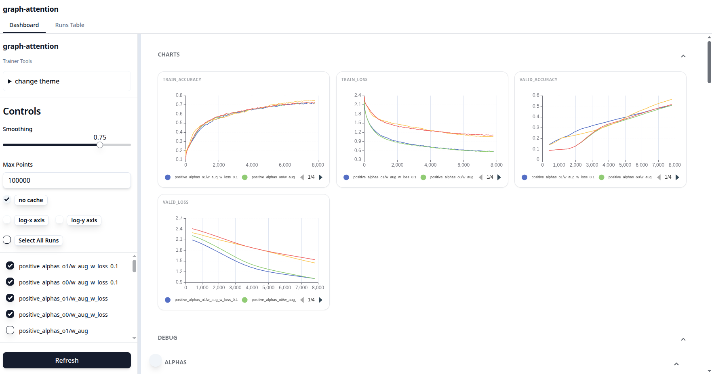

# trackio_ui

A simple UI for the trackio dashboard, written in **FastHTML**. The primary reason for creating this was the poor performance of the Gradio frontend for trackio.



With this UI, you can configure the maximum number of data points for graphs to prevent slow communication and rendering.

## Installation
```sh
pip install "trackio_ui @ git+https://github.com/ssslakter/trackio_ui.git"
```

## Getting Started
To start the local trackio-ui server, run the following command:
```sh
trackio-ui --project "trackio-project" --port 8080
```
**Note:** The project name must match your trackio project name. The application will look for the project `.db` file in `~/.cache/huggingface/trackio`.
